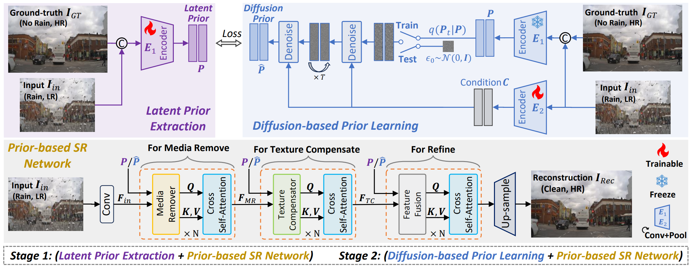

## [Seeing Through the Rain: Resolving High-Frequency Conflicts in Deraining and Super-Resolution via Diffusion Guidance](https://arxiv.org/pdf/2511.12419)

    <a href='https://24wenjie-li.github.io/' target='_blank'>Wenjie Li</a>1&emsp;
    <a href='https://scholar.google.com.hk/citations?user=9tYW9LcAAAAJ&hl=zh-CN&oi=ao' target='_blank'>Jinglei Shi</a>2&emsp;
    <a href='https://hjynwa.github.io/' target='_blank'>Jin Han</a>3&emsp;
    <a href='https://gh-home.github.io/' target='_blank'>Heng Guo</a>1&emsp;
    <a href='https://zhanyuma.cn/index.html' target='_blank'>Zhanyu Ma</a>1

    1Beijing University of Posts and Telecommunications&emsp; 
    2Nankai University&emsp; 
    3Noah’s Ark Lab&emsp; 

:star: If DHGM is helpful to your images or projects, please help star this repo. Thanks! :hugs: 

